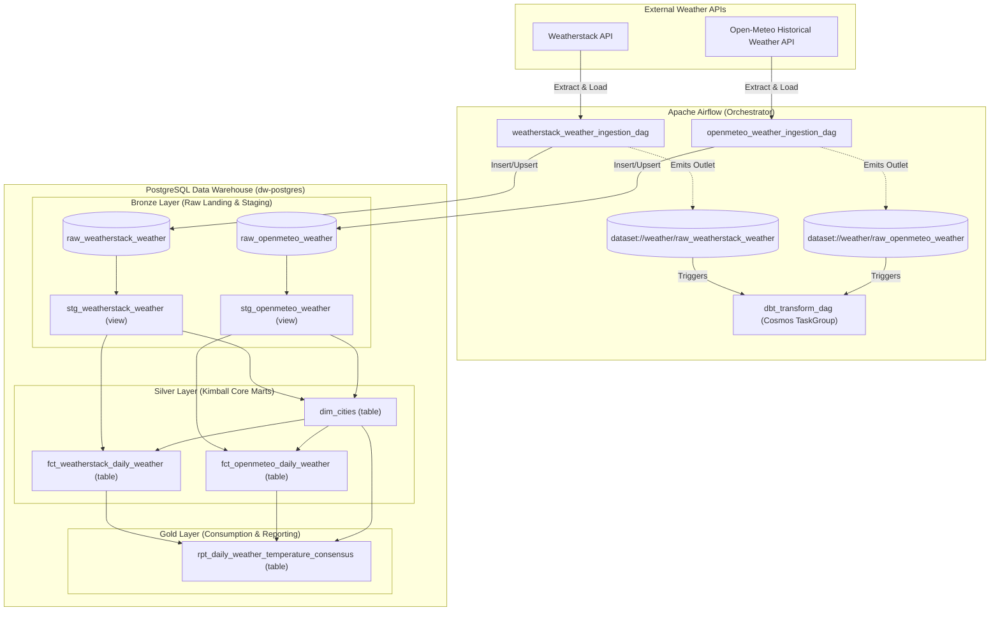

# Hands-on Airflow & dbt Weather Data Pipeline

An end-to-end ELT data pipeline orchestrating daily weather observation ingestion from multiple public APIs (**Weatherstack** and **Open-Meteo**) into a **PostgreSQL Data Warehouse**, transforming raw payloads into a conformed **Kimball Star Schema** using **dbt** and **Astronomer Cosmos**, driven by event-based **Airflow Datasets**.

---

## 1. Architecture Overview



### Technology Stack
- **Orchestrator**: [Apache Airflow 2.9.3](https://airflow.apache.org/) (`LocalExecutor` inside Docker Compose).
- **Transformation Engine**: [dbt-core](https://www.getdbt.com/) (`dbt-postgres` 1.9) orchestrated via [Astronomer Cosmos](https://astronomer.github.io/astronomer-cosmos/) 1.15.
- **Storage / Warehouse**: [PostgreSQL 16](https://www.postgresql.org/) (Container hostname: `dw-postgres:5432`, Host access: `localhost:5433`).
- **Python Environment**: Managed locally via [`uv`](https://github.com/astral-sh/uv) (Python 3.12).

---

## 2. Medallion & Dimensional Modeling Design

1. **Bronze (Staging)**:
   - Tables: `raw_weatherstack_weather`, `raw_openmeteo_weather` (JSON payloads).
   - Views: `stg_weatherstack_weather`, `stg_openmeteo_weather` (1:1 extraction, typed casting, and cleaning).
2. **Silver (Core Marts - Kimball Star Schema)**:
   - Conformed Dimension: `dim_cities` (Grain: one row per city, with surrogate key `city_sk` and SCD Type 1 overwrite-in-place).
   - Fact Tables: `fct_weatherstack_daily_weather` and `fct_openmeteo_daily_weather` (Grain: one row per city per observation date).
3. **Gold (Reporting Mart)**:
   - Mart Table: `rpt_daily_weather_temperature_consensus` (Pre-aggregated consensus table averaging temperatures across both providers, calculating variance, and tracking source counts).

---

## 3. Prerequisites

Before getting started, ensure you have the following installed on your machine:
- **Docker** (Engine 24+) & **Docker Compose** (v2+) — or **Podman** with `podman-compose`.
- **`uv`** (Python package installer & virtualenv manager):
  ```bash
  # Install uv (Linux/macOS)
  curl -LsSf https://astral.sh/uv/install.sh | sh
  ```
- **Git**

---

## 4. Local Deployment Guide (Step-by-Step)

### Step 1: Clone the Repository
```bash
git clone <repository-url>
cd hands-on-airflow
```

### Step 2: Configure Environment Variables
Copy the template configuration file:
```bash
cp .env.example .env
```

Generate the required cryptographic keys and add them to `.env`:
```bash
# 1. Generate Airflow Fernet Key:
uv run python -c "from cryptography.fernet import Fernet; print(Fernet.generate_key().decode())"

# 2. Generate Airflow Webserver Secret Key:
uv run python -c "import secrets; print(secrets.token_hex(32))"
```

Open `.env` and set:
- `AIRFLOW_UID`: Set to your host user ID (`id -u`).
- `AIRFLOW_FERNET_KEY`: Paste the generated Fernet key.
- `AIRFLOW_WEBSERVER_SECRET_KEY`: Paste the generated 32-byte hex key.
- Set custom passwords for `DW_PASSWORD` and `AIRFLOW_DB_PASSWORD` if desired.

### Step 3: Set Up Local Virtual Environment
Sync project dependencies locally with `uv`:
```bash
uv sync
```

### Step 4: Start Docker Services
Start the PostgreSQL Data Warehouse and Airflow services in detached mode:
```bash
docker compose up -d
```

Verify that all containers are healthy and running:
```bash
docker compose ps
```
You should see:
- `airflow-postgres` (Port 5432 internal - Metadata DB)
- `airflow-webserver` (Port 8080 exposed - Web UI)
- `airflow-scheduler` (Task execution & log server)
- `dw-postgres` (Port 5433 exposed to host - Target Warehouse)

### Step 5: Configure Airflow Connections
Open the Airflow Web UI at [http://localhost:8080](http://localhost:8080) and log in:
- **Username**: `admin` (or value of `AIRFLOW_ADMIN_USER` in `.env`)
- **Password**: `admin` (or value of `AIRFLOW_ADMIN_PASSWORD` in `.env`)

Navigate to **Admin $\rightarrow$ Connections** and verify/create the following connections:

1. **`postgres_dw`** (Pre-configured via environment in `docker-compose.yaml`):
   - **Connection Type**: `Postgres`
   - **Host**: `dw-postgres`
   - **Port**: `5432`
   - **Database**: `warehouse`
   - **Login**: `dw_user`
   - **Password**: *(Matches `DW_PASSWORD` in `.env`)*

2. **`openmeteo_api`** (For Open-Meteo historical weather):
   - **Connection Id**: `openmeteo_api`
   - **Connection Type**: `HTTP`
   - **Host**: `https://archive-api.open-meteo.com`

3. **`weatherstack_api`** (For Weatherstack real-time observation):
   - **Connection Id**: `weatherstack_api`
   - **Connection Type**: `HTTP`
   - **Host**: `http://api.weatherstack.com`
   - **Extra**: `{"access_key": "YOUR_WEATHERSTACK_API_KEY"}`

---

## 5. Running & Triggering Pipelines

### 5.1 Automatic Data-Aware Execution (Event-Driven)
In the Airflow Web UI:
1. Unpause **`weatherstack_weather_ingestion_dag`** and **`openmeteo_weather_ingestion_dag`**.
2. Unpause **`dbt_transform_dag`**.

When either ingestion DAG completes successfully, it emits an event to its dataset:
- `dataset://weather/raw_weatherstack_weather`
- `dataset://weather/raw_openmeteo_weather`

Airflow automatically catches the event and triggers **`dbt_transform_dag`**, executing the dbt run and test graph seamlessly. `max_active_runs=1` guarantees serial transformation in PostgreSQL without database lock contention.

### 5.2 Manual Testing via CLI
Trigger an ingestion directly from the host:
```bash
docker compose exec airflow-scheduler airflow dags trigger openmeteo_weather_ingestion_dag
```

---

## 6. Local dbt Development Workflows

You can run and test dbt models directly against the warehouse from your local host machine (targeting `localhost:5433`):

```bash
# Verify dbt connection to dw-postgres
uv run --env-file .env dbt debug --project-dir dbt --profiles-dir dbt

# Run all transformation models (Staging -> Silver -> Gold)
uv run --env-file .env dbt run --project-dir dbt --profiles-dir dbt

# Run all 38 data quality and foreign key relationship tests
uv run --env-file .env dbt test --project-dir dbt --profiles-dir dbt
```

---

## 7. Inspecting Warehouse Tables

You can query the Data Warehouse using `psql` or any DB tool (DBeaver, TablePlus, DataGrip) on `localhost:5433`:

```bash
PGPASSWORD=dw_password psql -h localhost -p 5433 -U dw_user -d warehouse
```

Sample query for consensus reporting:
```sql
SELECT 
    city,
    country,
    observation_date,
    openmeteo_temperature_c,
    weatherstack_temperature_c,
    avg_temperature_c,
    temperature_difference_c,
    sources_count,
    has_both_sources
FROM rpt_daily_weather_temperature_consensus
ORDER BY observation_date DESC
LIMIT 5;
```

---

## 8. Testing & Code Quality

Run tests and style checks before committing code:

```bash
# Run Airflow DagBag integrity tests
uv run pytest tests/test_dag_integrity.py

# Run linter checks
uv run ruff check .

# Check code formatting
uv run ruff format --check .
```

---

## 9. Stopping the Services

To shut down all running Docker containers:
```bash
docker compose down
```
To shut down and wipe persistent database volumes:
```bash
docker compose down -v
```
