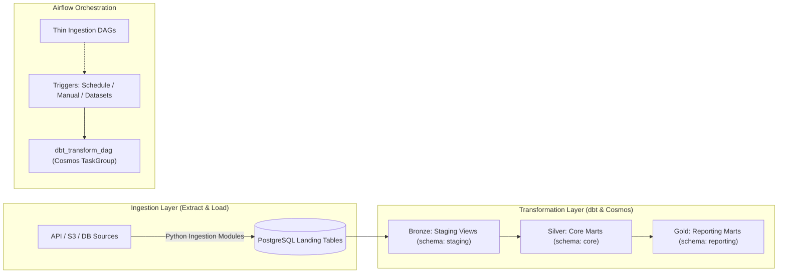

# Hands-on Airflow & dbt Data Platform

A modular, production-ready ELT data pipeline template orchestrated with **Apache Airflow**, transformed with **dbt** via **Astronomer Cosmos**, and backed by a **PostgreSQL Data Warehouse**. 

This platform follows the **Medallion Architecture** (Bronze $\rightarrow$ Silver $\rightarrow$ Gold) and **Kimball Star Schema** dimensional modeling standards, implementing the "Thin DAG" design principle.

---

## 1. Platform Architecture



### Technology Stack
- **Orchestrator**: [Apache Airflow 2.9.3](https://airflow.apache.org/) (`LocalExecutor` in Docker Compose).
- **Transformation Engine**: [dbt-core](https://www.getdbt.com/) (`dbt-postgres` 1.9) orchestrated dynamically into native Airflow tasks using [Astronomer Cosmos](https://astronomer.github.io/astronomer-cosmos/) 1.15.
- **Data Warehouse**: [PostgreSQL 16](https://www.postgresql.org/) (Container: `dw-postgres:5432`, Host port: `localhost:5433`).
- **Python Environment**: Managed locally via [`uv`](https://github.com/astral-sh/uv) (Python 3.11).

---

## 2. Quickstart

### 1. Prerequisites
- [Docker](https://docs.docker.com/get-docker/) & Docker Compose (or Podman with `podman-compose`).
- [`uv`](https://github.com/astral-sh/uv) (fast Python package and project manager):
  ```bash
  curl -LsSf https://astral.sh/uv/install.sh | sh
  ```

### 2. Configure Environment
Copy the environment template:
```bash
cp .env.example .env
```

Generate your Airflow Fernet and Webserver Secret keys:
```bash
# Fernet Key:
uv run python -c "from cryptography.fernet import Fernet; print(Fernet.generate_key().decode())"

# Webserver Secret Key:
uv run python -c "import secrets; print(secrets.token_hex(32))"
```
Paste these into `.env` alongside your host user ID (`AIRFLOW_UID=$(id -u)`).

### 3. Initialize Local Environment & Start Services
```bash
# Sync local virtual environment
uv sync

# Launch Airflow and PostgreSQL Warehouse
docker compose up -d
```

Check service health (`docker compose ps`):
- `airflow-webserver`: [http://localhost:8080](http://localhost:8080) (Default login: `admin` / `admin`).
- `airflow-scheduler`: LocalExecutor scheduling and log serving.
- `airflow-postgres`: Airflow internal metadata database.
- `dw-postgres`: Target Data Warehouse mapped to `localhost:5433`.

---

## 3. Directory Layout Conventions

```text
hands-on-airflow/
├── dags/                  # Thin Airflow DAG definitions ONLY (orchestration, schedules)
├── dbt/                   # dbt transformation project root
│   ├── dbt_project.yml    # dbt project configurations & materializations
│   ├── profiles.yml       # Dual-environment connection profile (host vs Docker)
│   ├── models/            
│   │   ├── staging/       # Bronze: 1:1 cleaning views over raw sources (schema: staging)
│   │   ├── core/          # Silver: Conformed Kimball Star Schema (dim_*, fct_*) (schema: core)
│   │   ├── reporting/     # Gold: Pre-aggregated BI & analytics rollups (rpt_*) (schema: reporting)
│   │   └── schema.yml     # Model documentation, grains & data quality tests
├── include/               # Reusable business logic outside DAG files
│   ├── datasets.py        # Central Airflow Dataset definitions
│   ├── sql/               # DDL scripts and raw landing schemas
│   └── ingestions/        # Source extraction and loading functions (EL logic)
├── tests/                 # Unit tests & DagBag integrity checks
├── docker-compose.yaml    # Multi-container Airflow & PostgreSQL DW stack
└── pyproject.toml         # Dependencies managed via uv
```

---

## 4. Pipeline Execution & Orchestration

Pipelines can be triggered through multiple patterns:

1. **Scheduled Runs**: Standard cron schedules defined on ingestion DAGs (e.g. `schedule="0 12 * * *"`).
2. **Event-Driven Datasets**: Ingestion tasks declare `outlets=[DATASET]`, allowing downstream transformation DAGs to trigger automatically upon successful data landing.
3. **Manual / API Triggers**: Trigger DAG runs via the Web UI or CLI:
   ```bash
   docker compose exec airflow-scheduler airflow dags trigger <dag_id>
   ```

> **Concurrency Safeguard**: Multi-source transformation DAGs set `max_active_runs=1` to guarantee serial execution in PostgreSQL, preventing relation lock contention.

---

## 5. Local dbt Development Workflows

Run transformations and tests directly from your host against `localhost:5433`:

```bash
# Verify connection to PostgreSQL Data Warehouse
uv run --env-file .env dbt debug --project-dir dbt --profiles-dir dbt

# Run transformation models (Staging -> Silver -> Gold)
uv run --env-file .env dbt run --project-dir dbt --profiles-dir dbt

# Run all schema and data quality tests
uv run --env-file .env dbt test --project-dir dbt --profiles-dir dbt
```

### Accessing the Warehouse
Direct host access via `psql` (port `5433`):
```bash
PGPASSWORD="${DW_PASSWORD:-dw_password}" psql -h localhost -p 5433 -U "${DW_USER:-dw_user}" -d "${DW_DB:-warehouse}"
```

---

## 6. Testing & Quality Assurance

Always verify DAG integrity and code style before committing:

```bash
# Verify DagBag parsing and check for syntax/import errors
uv run pytest tests/test_dag_integrity.py

# Linting & formatting
uv run ruff check .
uv run ruff format --check .
```

---

## 7. Teardown

```bash
# Stop running containers
docker compose down

# Stop and wipe persistent volumes (resets database)
docker compose down -v
```
